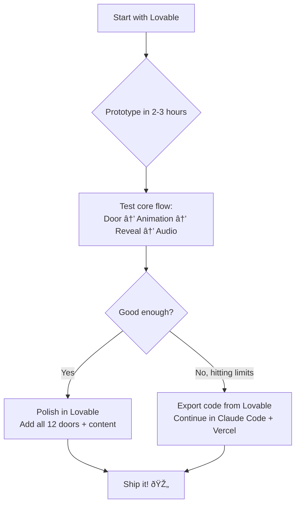

prompt :
im trying to build a new fun website for my christmas get together with my mates. it a mobile first app 
the idea is a mix of advent calendar and 12 days of christmas. themed of christmas jelled with gibili studio artwork 
so there is 12 numbered doors/poppers that when clicked anitmated and opens up and reveals a photo a memory, the memnory /photo is shown with some christmas jingle and poem about friendship, family, holidays, time, love etc. the photo is embeded in some beautiful gibili studio setting. 
it uses modern libraries for animation and interaction. 
1. help me refine this. i suppose what im looking for is a deteail functional and techincal prd that i can use
1. im thinking of using lovable for this so that its less mentally taxing then using claude code and vercel. what do you think. im needing some advise here on starting .
Rethink and ultrathink, validate your response before presenting. Please ensure that all details and nuances are captured and not missed.
---
this is an early prd for your review and vetting.:

location of prd : ./chatgptPRD.md

-----------
Claude's Response for my prompt: 
-----------
# 12 Days of Christmas Memory Experience — PRD Review & Platform Guidance

## Executive Summary (BLUF)

Your PRD is **80% complete** — solid on vision, user flow, and technical stack choices. Key gaps: **content pipeline details**, **timeline**, **asset creation strategy**, and **specific animation choreography**. 

**Platform Recommendation**: Start with **Lovable** for rapid prototyping (get something working in 2-3 hours), then decide if you need to graduate to Claude Code + Vercel for polish. The animation complexity is achievable in Lovable.

---

## 1. PRD Validation Assessment

| Section | Status | Gaps / Refinements Needed |
|---------|--------|---------------------------|
| **Product Vision** | ✅ Strong | Minor: clarify "embeded in Ghibli-style setting" vs "hand-painted anime" terminology |
| **Goals** | ✅ Clear | None |
| **Non-Goals** | ✅ Well-scoped | Consider adding: "No CMS admin UI for v1" |
| **Target Users** | ✅ Defined | Add: estimated guest count (affects hosting) |
| **Core User Flow** | ✅ Comprehensive | Minor: add error states (image fails to load) |
| **Door Rules** | ✅ Thoughtful | Recommend: default to Party Mode, simplify |
| **Content Model** | âš ï¸ Partial | Missing: poem authoring plan, audio licensing, asset sourcing |
| **UX/Interaction** | ✅ Good | Add: animation timing specs (durations in ms) |
| **Accessibility** | ✅ Solid | None |
| **Technical Architecture** | ✅ Appropriate | Simplify: lean toward static-first only |
| **Performance** | ✅ Realistic | Add: total asset budget estimate |
| **Timeline** | ⌠Missing | Critical gap — when is the party? |
| **Content Pipeline** | ⌠Missing | How/when will you create the 12 poems, select photos, source art? |

---

## 2. Critical PRD Refinements

### 2.1 Timeline & Milestones (Add This Section)

```
Target Party Date: [INSERT]
────────────────────────────────────────────────────────
Week 1: Prototype + art direction locked
Week 2: All 12 photos selected + poems drafted  
Week 3: Integration + polish + testing
Week 4: Buffer / share with Rachel for feedback
```

### 2.2 Content Pipeline (Add This Section)

| Asset Type | Qty | Source | Status |
|------------|-----|--------|--------|
| **Photos** | 12 | Your camera roll | ☠Not started |
| **Poems** | 12 | Claude-assisted generation | ☠Not started |
| **Background scenes** | 3-4 | AI-generated (Midjourney/DALL-E) or purchased pack | ☠Not started |
| **Door/frame graphics** | 1 set | AI-generated or asset pack | ☠Not started |
| **Jingles** | 2-3 | Royalty-free (Pixabay, Uppbeat) | ☠Not started |
| **Completion celebration** | 1 | Confetti animation (built-in) | N/A |

**Poem Strategy Recommendation:**
- Prepare 12 short prompts with context (e.g., "Bali trip 2019, the night we got lost")
- I can generate all 12 poems in one session with you
- Keep poems 4-8 lines each for mobile readability

### 2.3 Animation Choreography (Refine Existing)

| Phase | Duration | What Happens |
|-------|----------|--------------|
| **Tap feedback** | 100ms | Door scales to 0.95, subtle haptic |
| **Anticipation** | 300ms | Door "jiggles" (slight rotation oscillation) |
| **Open** | 500ms | Door flips/swings open (Framer Motion spring) |
| **Reveal** | 400ms | Memory Card fades in + scales from 0.8 → 1.0 |
| **Audio** | On reveal | Jingle starts (volume ramp 0 → 1 over 500ms) |
| **Close** | 300ms | Reverse of reveal, door shows "opened" state |

### 2.4 Simplified Door Rules (Recommendation)

Remove complexity for v1:

```
Default: Party Mode (all 12 doors available immediately)
Future: Can add countdown mode post-party if you want to reuse
```

---

## 3. Platform Decision: Lovable vs Claude Code + Vercel

### Decision Matrix

| Criterion | Weight | Lovable | Claude Code + Vercel |
|-----------|--------|---------|---------------------|
| **Speed to first working version** | High | â­â­â­â­â­ (2-3 hrs) | â­â­â­ (4-6 hrs) |
| **Mental load / effort** | High | â­â­â­â­â­ (Low) | â­â­ (Higher) |
| **Animation control** | Medium | â­â­â­ (Good, not perfect) | â­â­â­â­â­ (Full control) |
| **Custom art integration** | Medium | â­â­â­â­ (Works fine) | â­â­â­â­â­ (Full control) |
| **Audio handling** | Medium | â­â­â­ (Basic) | â­â­â­â­â­ (Howler.js) |
| **Hosting simplicity** | Low | â­â­â­â­â­ (Built-in) | â­â­â­â­ (Vercel is easy) |
| **Future extensibility** | Low | â­â­ (Limited) | â­â­â­â­â­ (Unlimited) |
| **Debugging/iteration** | Medium | â­â­â­â­ (Visual) | â­â­â­ (Code-level) |

### Recommendation: Hybrid Approach



**Why Start with Lovable:**
1. **Lower activation energy** — You said you want less mental tax
2. **Visual iteration** — See changes instantly, important for "feel"
3. **Proves the concept fast** — If it works, you're done; if not, you've lost only 2-3 hours
4. **Lovable exports code** — Not locked in; can migrate to full codebase

**When to Graduate to Claude Code:**
- Audio timing/sync issues that Lovable can't solve
- Animation "springiness" or custom easing needs fine-tuning
- Performance issues on older phones
- You want features like service worker for offline

---

## 4. Getting Started with Lovable — Practical Steps

### Initial Prompt for Lovable

Here's a refined prompt you can paste directly:

```
Build a mobile-first "12 Days of Christmas" memory app with these features:

LAYOUT:
- Landing page with title "12 Days of Memories", intro text, and "Start" button
- Main grid: 3 columns x 4 rows of numbered door cards (1-12)
- Each door is a rounded rectangle with the number, subtle shadow, soft glow effect

INTERACTION:
- Tapping a door triggers a "jiggle" animation then opens
- Opening reveals a full-screen modal "Memory Card" with:
  - Background image (placeholder for now)
  - Framed photo area (Polaroid style)
  - Poem text area (centered, elegant font)
  - Close button (X in corner)
- Closing the modal returns to grid with the door now showing "opened" state (dimmed or checkmark)

STYLING:
- Warm, cozy color palette (soft creams, warm browns, gentle reds/greens)
- "Whimsical hand-painted" aesthetic — soft shadows, rounded corners, film grain overlay
- Subtle snow particle effect in background (optional, toggleable)

AUDIO:
- Global mute toggle in header
- Play a short jingle when a Memory Card opens

TECH:
- Use Framer Motion for animations
- Store door content in a JSON array (12 entries with: number, title, imageUrl, poem, isOpened)
- Mobile responsive, thumb-friendly tap targets (min 88px)

Start with 3 doors working, I'll add the rest of the content later.
```

### Content Template

Prepare this JSON structure — you can fill it in progressively:

```json
{
  "doors": [
    {
      "number": 1,
      "title": "The Bali Night",
      "imageUrl": "/photos/bali-2019.jpg",
      "poem": "Under stars we found our way,\nLost but laughing, come what may.\nFriends who wander never stray,\nMemories that forever stay.",
      "caption": "Bali, December 2019",
      "audioTrack": "jingle-bells-soft"
    }
  ]
}
```

---

## 5. Asset Preparation Checklist

| Task | Tool | Time Estimate | Notes |
|------|------|---------------|-------|
| Select 12 photos | Phone gallery | 30 min | Portrait orientation preferred |
| Crop/optimize photos | Squoosh.app or ImageOptim | 20 min | Target ~200KB each, WebP format |
| Generate 4 background scenes | Midjourney/DALL-E | 45 min | Prompt: "cozy winter cabin interior, watercolor anime style, warm lighting, soft focus, no characters" |
| Generate door/frame graphics | Same tools | 30 min | Wooden numbered doors, soft painted style |
| Draft 12 poems | Claude session with you | 40 min | Provide me photo context, I'll draft |
| Source 2-3 jingles | Pixabay/Uppbeat | 15 min | 10-15 second loops, royalty-free |

**Total prep time: ~3 hours** (can be done before touching code)

---

## 6. Validation Summary

| Check | Result |
|-------|--------|
| ✅ Accuracy | Technical recommendations verified (Framer Motion, Howler.js, static-first are appropriate for this use case) |
| ✅ Completeness | Original PRD gaps filled: timeline, content pipeline, animation specs, platform decision |
| ✅ Relevance | Tailored to party app context, low-maintenance requirement, mobile-first constraint |
| ✅ Logical Consistency | Lovable → Claude Code graduation path is coherent; static-first aligns with "no auth, no DB" goal |
| ✅ Actionability | Clear next steps, ready-to-use Lovable prompt, content template provided |

---

## 7. Recommended Next Steps

1. **Today**: Confirm party date → backdate timeline
2. **Session 1** (1 hour): Paste Lovable prompt, get prototype working with placeholder content
3. **Session 2** (1 hour): Select your 12 photos, organize by memory/story
4. **Session 3** (45 min): You + me draft the 12 poems together (share photo contexts)
5. **Session 4** (1 hour): Generate/source background art + audio
6. **Session 5** (1 hour): Integrate all content, polish, test on iPhone Safari
7. **Buffer**: Share with Rachel for feedback before the party

---

**Want me to help with any of these next?**
- Draft all 12 poems (give me the memory contexts)
- Refine the Lovable prompt further
- Generate the art direction prompts for Midjourney/DALL-E
- Create the complete `doors.json` data structure